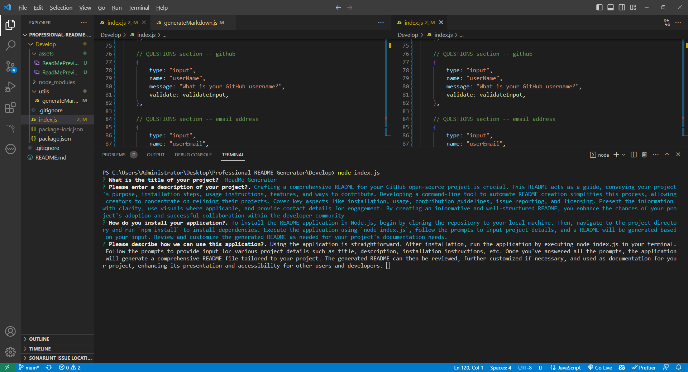
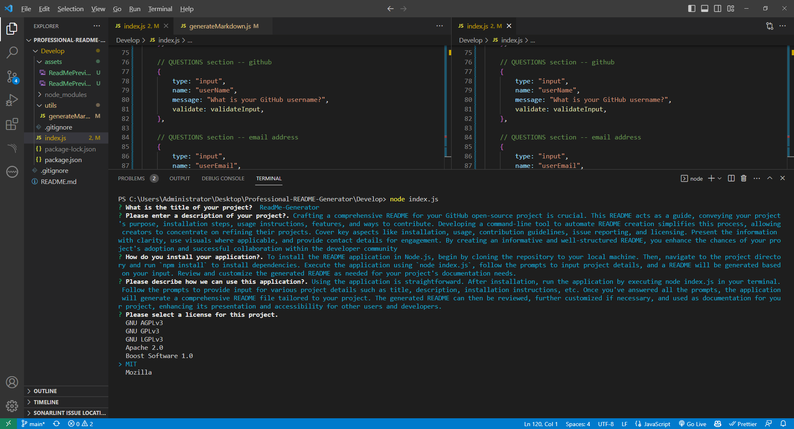
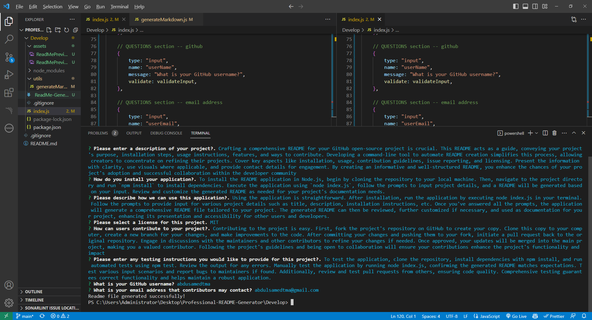
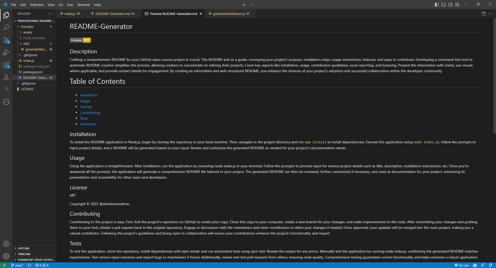
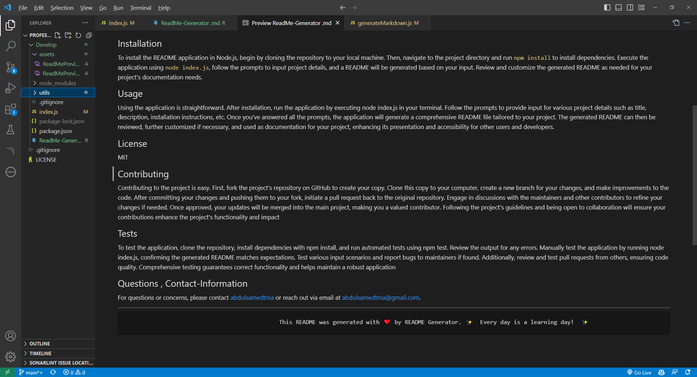

# Professional README Generator Starter Code
## Description
Crafting a comprehensive README for your GitHub open-source project is crucial. This README acts as a guide, conveying your project's purpose, installation steps, usage instructions, features, and ways to contribute. Developing a command-line tool to automate README creation simplifies this process, allowing creators to concentrate on refining their projects. Cover key aspects like installation, usage, contribution guidelines, issue reporting, and licensing. Present the information with clarity, use visuals where applicable, and provide contact details for engagement. By creating an informative and well-structured README, you enhance the chances of your project's adoption and successful collaboration within the developer community

## Key Summary features of this project include:

Here are the key features of a README generator using Node.js summarized in 5 bullet points:

1. **Interactive Input:** User-friendly prompts for project details like title, description, and guidelines.

2. **Dynamic Markdown:** Automatically generates a well-formatted README in Markdown based on input.

3. **Template Options:** Offers customizable templates or styles to match different project types.

4. **Badge Integration:** Incorporates badges for status indicators like CI/CD, coverage, and version.

5. **Contributor Support:** Provides guidelines, contact info, and contributor instructions for collaboration.

**Motivation** 
Creating a README generator as a bootcamp coding student offers several compelling motivations:

1. **Hands-On Learning:** Developing a README generator provides practical experience in building a real-world software tool, allowing students to apply coding skills and gain a deeper understanding of programming concepts.

2. **Documentation Practice:** Writing a README is an essential skill for any software developer. Creating a generator teaches students how to structure documentation effectively and communicate project details to users and collaborators.

3. **Problem Solving:** Designing an interactive CLI application challenges students to problem-solve and make design decisions, enhancing critical thinking and logical reasoning abilities.

4. **Tool Customization:** Tailoring the generator's features and templates to match personal preferences or project needs enables students to create a tool that aligns with their coding style and goals.

5. **Workflow Efficiency:** A README generator streamlines future project setups by automating the creation of documentation, saving time and effort when starting new projects.

6. **Version Control Mastery:** Developing the generator reinforces version control concepts, as students manage changes, branching, and collaboration within their generator project.

7. **Open-Source Contribution:** Once refined, the generator could be shared as an open-source project, allowing students to contribute to the developer community and showcase their skills to potential employers.

8. **Resume and Portfolio:** Demonstrating a README generator on a resume or portfolio highlights a student's ability to create practical tools and showcases their commitment to improving the development process.

9. **Problem Solving:** Tackling challenges encountered while building the generator nurtures problem-solving skills, resourcefulness, and the ability to debug and optimize code.

10. **Confidence Boost:** Successfully completing a useful project like a README generator boosts confidence, validating a student's coding abilities and encouraging them to take on more complex projects in the future.

Overall, creating a README generator offers bootcamp coding students a well-rounded learning experience that encompasses coding, documentation, problem-solving, and tool creation—skills that are highly valuable in the world of software development.

## Installation
To install and use the README generator program, follow these steps:

1. **Clone the Repository:**
   Open your terminal and navigate to the directory where you want to install the README generator. Then, run the following command to clone the repository:
   ```
   git clone https://github.com/your-username/readme-generator.git
   ```

2. **Navigate to the Project Directory:**
   Move into the project directory using the `cd` command:
   ```
   cd readme-generator
   ```

3. **Install Dependencies:**
   Install the required dependencies by running:
   ```
   npm install
   ```

4. **Run the Generator:**
   Start the generator by running the following command in the terminal:
   ```
   node index.js
   ```

5. **Follow the Prompts:**
   The generator will prompt you to provide information about your project, such as title, description, installation instructions, usage guidelines, and more. Follow the prompts and provide the required details.

6. **Generated README:**
   After providing all the information, the generator will generate a README markdown file based on your input. The generated README will be saved as `README.md` in the project directory.

7. **Review and Customize:**
   Open the generated `README.md` file to review the content. You can further customize and format the README according to your needs.

8. **Add to Your Project:**
   Copy the contents of the generated README and paste them into your project's root directory or repository on platforms like GitHub.

9. **Commit and Push Changes:**
   If you're using version control (e.g., Git), commit and push the changes to your repository:
   ```
   git add README.md
   git commit -m "Add generated README"
   git push origin main
   ```

By following these steps, you'll successfully install and use the README generator program to create a well-structured and informative README for your projects..







## Usage.
Using the application is straightforward. After installation, run the application by executing node index.js in your terminal. Follow the prompts to provide input for various project details such as title, description, installation instructions, etc. Once you've answered all the prompts, the application will generate a comprehensive README file tailored to your project. The generated README can then be reviewed, further customized if necessary, and used as documentation for your project, enhancing its presentation and accessibility for other users and developers. 
By following these steps, you'll successfully install and use the README generator program to create a well-structured and informative README for your projects.

## Credit 
N/A.

## License

MIT License

Copyright (c) 2023 abdulsamedtma

Permission is hereby granted, free of charge, to any person obtaining a copy
---
## Features

The features of the README generator you provided include:

1. **Interactive Prompt:** The generator utilizes an interactive command-line interface (CLI) that prompts users for essential project details, ensuring comprehensive and accurate documentation.

2. **Dynamic Markdown Generation:** Based on user input, the generator dynamically generates a well-structured README markdown file, eliminating the need for manual markdown formatting.

3. **Customizable Template:** The generator offers customizable templates or predefined styles for different project types, enhancing flexibility and allowing users to tailor the README to their project's needs.

4. **Badge Integration:** The generator automatically integrates badges (e.g., CI/CD status, coverage, version) into the README, providing visual indicators of project status and quality.

5. **Consistent Structure:** The generated README follows a consistent structure, including sections such as title, description, installation instructions, usage guidelines, contribution guidelines, and licensing information.

6. **Dependency Installation:** For projects requiring dependencies, the generator assists in creating installation commands or guidelines, simplifying the setup process.

7. **Contributor Guidelines:** The generated README includes contributor guidelines, encouraging collaboration and providing clear instructions for potential contributors.

8. **Table of Contents:** A well-organized table of contents allows users to easily navigate the README and locate specific information.

9. **Formatted Examples:** The generator may provide formatted examples, code snippets, or screenshots to enhance understanding and showcase project features.

10. **Version Control Integration:** The README generator may integrate with version control systems (e.g., Git) to automatically update and commit changes to the generated README file.

11. **Efficiency and Time Savings:** By automating README creation, the generator streamlines the documentation process, saving time and effort for developers.

12. **Professional Presentation:** The generated README exhibits a professional and polished appearance, enhancing the project's presentation and credibility.

Overall, the README generator offers a comprehensive solution for creating informative, well-structured, and visually appealing README files for software projects, fostering effective communication and collaboration among developers and users.

## How to Contribute
Contributing to the project is easy. First, fork the project's repository on GitHub to create your copy. Clone this copy to your computer, create a new branch for your changes, and make improvements to the code. After committing your changes and pushing them to your fork, initiate a pull request back to the original repository. Engage in discussions with the maintainers and other contributors to refine your changes if needed. Once approved, your updates will be merged into the main project, making you a valued contributor. Following the project's guidelines and being open to collaboration will ensure your contributions enhance the project's functionality and impact
Contributions are always welcome! But please read the contribution guidelines first on [Contributor Covenant](https://www.contributor-covenant.org/).

## Test
To test the application, clone the repository, install dependencies with npm install, and run automated tests using npm test. Review the output for any errors. Manually test the application by running node index.js, confirming the generated README matches expectations. Test various input scenarios and report bugs to maintainers if found. Additionally, review and test pull requests from others, ensuring code quality. Comprehensive testing guarantees correct functionality and helps maintain a robust application.
Repository URL : https://github.com/abdulsamedtma/professional-readme-generator
Walkthrough video URL : https://drive.google.com/file/d/17z04Ys-r2EEXe_ja0xnXbC7u-tvpfsgb/view

                  This README was generated with ❤️ by README Generator. ✨  Every day is a learning day!  ✨